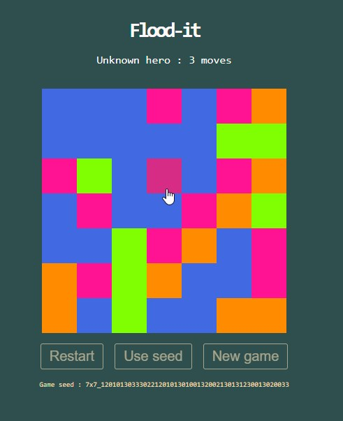

# Flood-it

> Flood-it, a game for liquid snakes.

## Thanks

- [Boxy Svg](https://boxy-svg.com) : simple & effective svg editor
- [Bun](https://bun.sh) : super fast runtime for JavaScript and TypeScript
- [Github](https://github.com) : for all their great work year after year, pushing OSS forward
- [Knip](https://github.com/webpro/knip) : super tool to find & fix problems
- [Netlify](https://netlify.com) : awesome company that offers free CI & hosting for OSS projects
- [Preact](https://preactjs.com) : fast 3kB alternative to React
- [Repo-checker](https://github.com/Shuunen/repo-checker) : eslint cover /src code and this tool the rest ^^
- [Shields.io](https://shields.io) : for the nice badges on top of this readme
- [Shuutils](https://github.com/Shuunen/shuutils) : collection of pure JS utils
- [Svg Omg](https://jakearchibald.github.io/svgomg/) : the great king of svg file size reduction
- [TailwindCss](https://tailwindcss.com) : awesome lib to produce maintainable style
- [Vite](https://github.com/vitejs/vite) : super fast frontend tooling

## Page views

